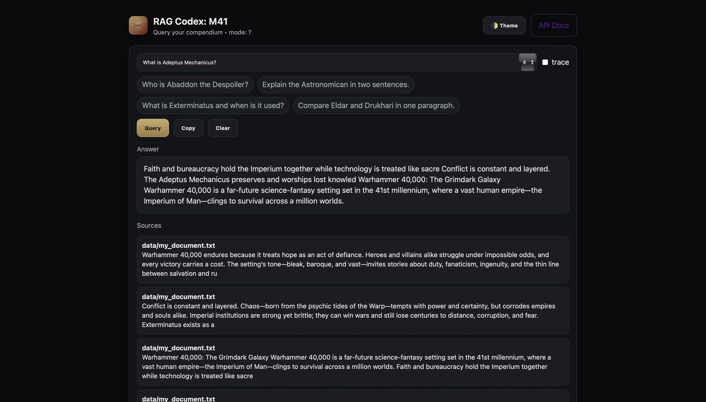

# Astronomicon

> Retrieval-Augmented Generation over Warhammer 40,000 lore.  
> I got tired of my friends constantly asking me questions about 40K, so I built this to answer them fast—with sources and provenance.



---

## Table of Contents

1. [Motivation](#motivation)  
2. [High-Level Design](#high-level-design)  
3. [Architecture & Components](#architecture--components)  
4. [Installation](#installation)  
5. [Configuration](#configuration)  
6. [Usage](#usage)  
7. [Extending / Adding New Lore](#extending--adding-new-lore)  
8. [Answer Generation & Citation Policy](#answer-generation--citation-policy)  
9. [Evaluation & Metrics](#evaluation--metrics)  
10. [Development Workflow](#development-workflow)  
11. [Deployment (Free / No-Cost Mode)](#deployment-free--no-cost-mode)  
12. [Troubleshooting](#troubleshooting)  
13. [Future Work](#future-work)  
14. [Contributing](#contributing)  
15. [License](#license)

---

## Motivation

Warhammer 40K lore is vast, fragmented, and constantly referenced in casual conversation. The goal of **Astronomicon** is simple: stop repeating yourself.  
Ask a question. Get a concise, sourced answer immediately. No manual searching through codices, no fuzzy memory. Reliable retrieval with provenance, wrapped in a minimal, practical service.

---

## High-Level Design

Astronomicon is a **Retrieval-Augmented Generation (RAG)** service that layers:
- **Document retrieval** over a local lore corpus,
- Optional **semantic augmentation** via embeddings and an LLM synthesizer,
- **Answer assembly** with explicit source attribution.

It falls back gracefully to a lightweight, zero-key mode. Upgrade to richer embedding+LLM modes if desired.

---

## Architecture & Components

### Core paths

- **Data ingestion / corpus**: Local text files (Warhammer 40K compendium) are split into queryable chunks.
- **Retriever**: Finds relevant passages given a user question (vector or keyword based depending on mode).
- **Synthesizer (optional)**: Combines retrieved context into a coherent answer with optional LLM assistance.
- **Provenance layer**: Tracks and surfaces which source chunks contributed to each answer.
- **API layer**: FastAPI exposes endpoints for querying, health, and UI.

### Key modules

- `rag/` (or equivalent): Initialization, vector store management, retrieval logic, embedding handling.
- `endpoints/`: HTTP router exposing:
  - `/query/` — question input, returns answer + sources.
  - `/healthz` — liveness/version.
  - `/ui` — lightweight HTML frontend.
- `main.py`: Application bootstrap, lifespan warming of RAG backend.
- Embedding backend (optional): plugs into OpenAI or local embedding provider.
- Chat/answer synthesis backend (optional): uses an LLM to fuse retrieved context into fluent answers when enabled.

---

## Installation

Assumes Python 3.11+.

```bash
# clone repository
git clone <your-repo-url>
cd Astronomicon

# create venv and activate
python -m venv .venv
source .venv/bin/activate      # or `.venv\Scripts\activate` on Windows

# install dependencies
pip install -r requirements.txt

## OpenAI-enhanced Mode

If you want the OpenAI-enhanced mode:
```bash
export OPENAI_API_KEY=your_key_here

Configuration
The system can run in two modes:
Basic mode (no API key, uses local retrieval only)
OpenAI mode (requires API key, adds embeddings + LLM synthesis)
You can configure it with environment variables or a .env file.
Variable	Purpose
OPENAI_API_KEY	Enables embedding + chat synthesis
EMBEDDING_MODEL	Optional: defaults to text-embedding-ada-002
CHAT_MODEL	Optional: defaults to gpt-3.5-turbo
CORS_ALLOW_ORIGINS	Defaults to *
APP_VERSION	Metadata only
Usage
Start the backend:
uvicorn main:app --reload
Once running, the service exposes:
GET / — Service info
GET /healthz — Liveness check
GET /ui — Minimal built-in UI for direct questions
POST /query/ — Main endpoint for asking questions
Example POST payload:
{
  "question": "Who is the God-Emperor?",
  "mode": "openai"
}
Response includes the answer, source passages, and retrieval metadata.
Extending / Adding New Lore
I designed Astronomicon to be expandable. To add more content:
Drop new .txt files into the corpus directory.
Make sure each file has clear formatting (paragraphs, sections).
Restart the backend. If embeddings are used, the system will re-index.
Every chunk is stored with provenance: file name, source location, and text snippet. This ensures citations stay accurate even as the corpus grows.
Answer Generation & Citation Policy
Answers are built on retrieved context, not speculation.
In basic mode, answers are selected directly from best-matching chunks.
In OpenAI mode, the LLM is instructed to only synthesize from retrieved sources.
Each answer includes source IDs, snippets, and titles. No hallucinations. Everything can be traced back to the original document and line.
Citation format example:
Answer: ... [1]

Sources:
[1] Codex: Imperium — “The Astronomicon burns as a beacon...” (score 0.87)
Evaluation & Metrics
This is a side project, but I still wanted measurable quality.
I assess:
Precision@k: Are the top passages actually relevant?
Latency: Does a query return in under 200ms (basic mode)?
Answer quality: Does synthesis reflect source content without distortion?
Coverage: Can it answer broad and obscure 40K questions?
A proper test harness can be added later with known Q&A pairs.
Development Workflow
My workflow is simple:
# Make a feature branch
git checkout -b feature/x

# Make changes, commit
git add .
git commit -m "feat: add lore chunking optimization"

# Push
git push origin feature/x
Pull requests are welcome. Stick to focused commits. Don’t introduce lore without source attribution. Code should follow PEP8.
Deployment (Free / No-Cost Mode)
Astronomicon works entirely offline in basic mode, with no API keys or cloud dependencies. This makes it easy to deploy on:
Free VPS instances (Fly.io, Railway, etc.)
Local servers (Uvicorn)
Containers
To save cost:
Avoid OpenAI mode.
Disable re-indexing on startup.
Use a persistent vector store if you’re embedding.
Troubleshooting
Q: I get no answer for a valid question
→ Check that the corpus is loaded and split correctly. Try rephrasing the question.
Q: OpenAI features aren’t working
→ Verify your OPENAI_API_KEY is set and hasn’t expired. Check network access.
Q: CORS issues from frontend
→ Set CORS_ALLOW_ORIGINS env variable accordingly.
Q: Slow response time
→ Use smaller chunk sizes. Avoid rebuilding index every time you run.
Future Work
Things I might add if I keep working on this:
Local embedding + LLM support (no OpenAI)
Plugin-style loaders for other IPs (LotR, Dune, etc.)
Conversation history / memory
RAG + graph hybrid for tracking character relationships
More structured citations (page numbers, line context)
Contributing
Contributions are welcome, but stay disciplined.
All lore must be real, sourced, and quoted.
Keep answers truthful and grounded.
Follow a clean commit style (feat:, fix:, etc.)
Don’t bloat the codebase with non-essential dependencies.
PRs that break citation traceability will be rejected.
License
MIT License. You can use, modify, and share this freely.
See the LICENSE file for full terms.
Professor’s note: Keep your corpus versioned. When you add or remove lore, invalidate and rebuild the index. Reliability comes from repeatability, traceability, and disciplined maintenance. Astronomicon is the tool; your rigor is what makes its answers trustworthy.